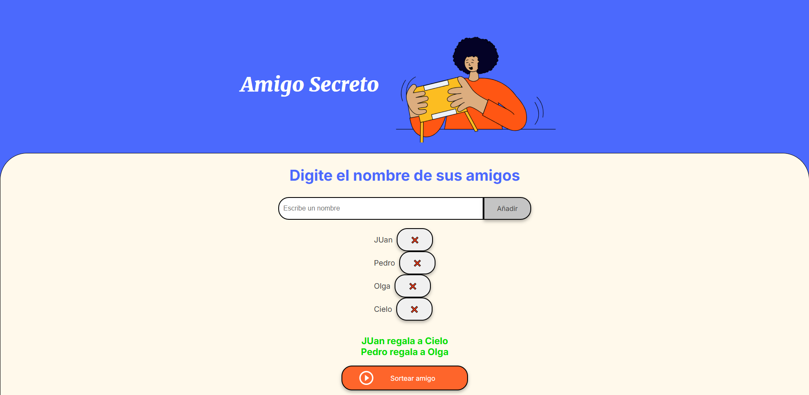

# 🎁 Amigo Secreto

Este es un proyecto web simple para organizar un sorteo de **Amigo Secreto** entre un grupo de personas.  
Permite agregar nombres, eliminarlos y realizar el sorteo asegurando que nadie se asigne a sí mismo.

## 🚀 Características

- ✅ Agregar nombres a la lista de participantes  
- ❌ Evitar nombres duplicados  
- 🗑️ Eliminar nombres de la lista  
- 🎲 Sortear el Amigo Secreto asegurando que nadie se asigne a sí mismo  
- 📢 Mostrar los resultados del sorteo  
- ⌨️ Presionar **Enter** para agregar nombres  

## 📂 Estructura del Proyecto

```bash
📁 amigo-secreto/
│-- 📄 index.html       # Estructura principal de la página
│-- 📄 style.css        # Estilos para la interfaz
│-- 📄 app.js           # Lógica del sorteo y manejo de la lista
│-- 📁 assets/          # Imágenes y otros recursos

## 🛠️ Tecnologías Utilizadas

- HTML5 → Estructura del sitio

- CSS3 → Estilos y diseño visual

- JavaScript (ES6) → Lógica del sorteo y manipulación del DOM

## 📜 Cómo Usar

- Clonar el repositorio

    git clone https://github.com/tu-usuario/amigo-secreto.git

- Abrir el archivo index.html en el navegador

- Agregar los nombres de los participantes

- Presionar el botón "Sortear amigo"

- Ver los resultados del sorteo

## 📌 Capturas de Pantalla




## 📈 Mejoras Futuras

- 🔄 Implementar la funcionalidad para restablecer el sorteo

- 🎨 Mejorar el diseño y la experiencia de usuario

- 📱 Optimización para dispositivos móviles

## 🏆 Contribución

Si deseas mejorar este proyecto, ¡las contribuciones son bienvenidas!Puedes enviar un pull request o sugerencias en la sección de issues.

## 📄 Licencia

Este proyecto está bajo la licencia MIT. Puedes usarlo y modificarlo libremente. 🎉

